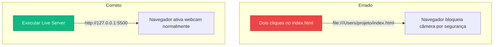

## **Preparando o Editor de Código (VS Code e Live Server)**

**O seu objetivo aqui:** Configurar a sua principal ferramenta de trabalho instalando o editor de código Visual Studio Code (VS Code) e ativar a extensão Live Server para visualizar a renderização das suas páginas web em tempo real no seu navegador de internet padrão.

---

### **Conceitos Fundamentais**

#### **1. O que é o VS Code?**

O **VS Code (Visual Studio Code)** é o editor de texto e código-fonte gratuito mais utilizado por programadores no mundo. Desenvolvido pela Microsoft, ele facilita muito o trabalho de desenvolvimento porque colore as palavras-chave da linguagem (HTML, JavaScript, CSS), avisa quando há algum erro de digitação e permite instalar ferramentas extras que tornam a criação de sites muito mais rápida.

#### **2. Por que usar a extensão Live Server?**

Para visualizar uma página web em desenvolvimento, o navegador de internet precisa interpretar o arquivo. Contudo, para recursos avançados como Realidade Aumentada ou scripts complexos, abrir o arquivo diretamente no navegador com dois cliques (usando o protocolo `file://`) pode bloquear o funcionamento por questões de segurança do navegador.

A extensão **Live Server** resolve esse problema criando um **servidor local de desenvolvimento** dentro do seu próprio computador. Ela gera um endereço local temporário (como `http://127.0.0.1:5500` ou similar) e abre a página no seu navegador de internet externo. Isso é extremamente importante para projetos de Realidade Aumentada (WebAR), pois o navegador integrado do VS Code (usado por extensões como o Live Preview) **bloqueia o acesso à câmera por motivos de segurança**. Usando o Live Server no seu navegador real, você poderá conceder a permissão da webcam normalmente.



---

### **Mão na Massa: Passo a Passo**

#### **Passo 1: Baixando e Instalando o VS Code**

1. Acesse o site oficial do [Visual Studio Code](https://code.visualstudio.com/).
2. Baixe a versão correspondente ao sistema operacional do seu computador (Windows, macOS ou Linux).
3. Execute o instalador baixado e siga as etapas padrão de instalação na tela até concluir.

#### **Passo 2: Instalando a extensão Live Server**

1. Abra o Visual Studio Code.
2. Na barra lateral esquerda, clique no ícone de **Extensions** (Extensões) – representado por quatro blocos quadrados (o atalho é `Ctrl + Shift + X` no Windows/Linux ou `Cmd + Shift + X` no Mac).
3. Na barra de pesquisa que aparecer no topo esquerdo, digite `Live Server`.
4. Procure pela extensão oficial publicada por **Ritwick Dey**.
5. Clique no botão azul **Install** (Instalar). Aguarde alguns segundos até que a instalação seja concluída.

#### **Passo 3: Criando a sua Pasta de Trabalho**

1. No seu computador, crie uma pasta vazia em um local fácil (como a Área de Trabalho) chamada `meu-projeto-webar`.
2. No VS Code, acesse o menu superior e clique em **File > Open Folder...** (Arquivo > Abrir Pasta...).
3. Selecione a pasta `meu-projeto-webar` que você acabou de criar e clique em **Abrir**.
4. Se o VS Code perguntar se você confia nos autores desta pasta, clique em _Yes, I trust the authors_ (Sim, eu confio nos autores).

#### **Passo 4: Criando seu Primeiro Arquivo e Visualizando**

1. Na barra lateral esquerda do VS Code (Explorer), clique no ícone de **New File** (Novo Arquivo) ao lado do nome da sua pasta ou clique em **File > New File**.
2. Nomeie o arquivo como `index.html` e aperte `Enter`.
3. Escreva o seguinte código básico dentro do arquivo:

```html
<!DOCTYPE html>
<html lang="pt-BR">
  <head>
    <meta charset="UTF-8" />
    <title>Teste de Ambiente</title>
  </head>
  <body>
    <h1>Ambiente Configurado com Sucesso!</h1>
    <p>O VS Code e o Live Server já estão funcionando juntos.</p>
  </body>
</html>
```

4. Salve o arquivo pressionando `Ctrl + S` (Windows) ou `Cmd + S` (Mac).
5. Com o arquivo `index.html` aberto no editor, clique na opção **Go Live** que aparece na barra de status azul no canto inferior direito do VS Code (ou clique com o botão direito sobre o código e selecione **Open with Live Server**).
6. O seu navegador web padrão (Chrome, Firefox, etc.) será aberto automaticamente na página `http://127.0.0.1:5500/index.html` mostrando a mensagem que você escreveu!

---

### **Desafio Prático**

1. Com o seu navegador aberto lado a lado com o VS Code, altere o texto dentro da tag `<p>` para: `Esta página está sendo atualizada ao vivo pelo Live Server!`
2. Salve o arquivo (`Ctrl + S` ou `Cmd + S`).
3. Verifique se o texto mudou imediatamente no seu navegador sem que você precisasse recarregar a página manualmente.
