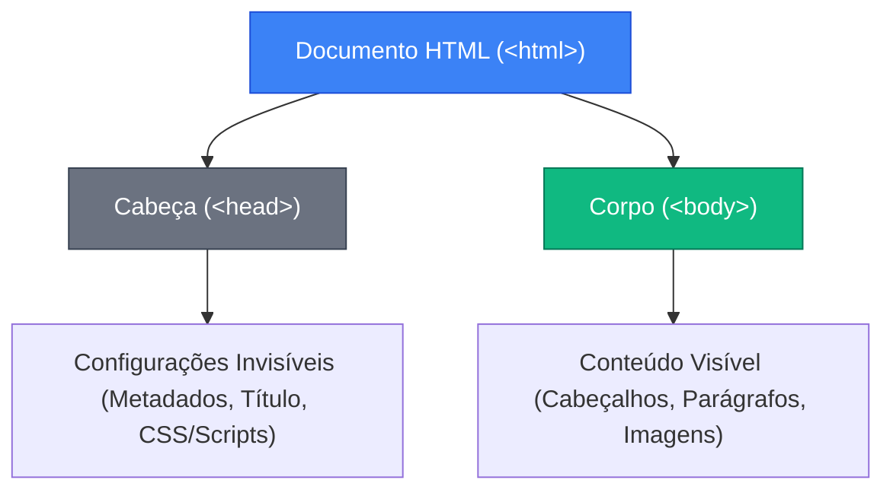

## **Introdução Rápida ao HTML (A Fundação)**

**O seu objetivo aqui:** Compreender a estrutura de uma página de internet, dominar o uso de tags e atributos, e construir a fundação de código em HTML necessária para abrigar qualquer projeto de Realidade Aumentada.

---

### **Conceitos Fundamentais**

#### **1. O que é HTML? (A Metáfora da Construção)**

Para entender o desenvolvimento web, pense na construção de uma casa:

- **HTML (HyperText Markup Language):** É a estrutura física, os tijolos, vigas e paredes. Ele define _o que_ está na página (um título, um botão, uma imagem).
- **CSS (Cascading Style Sheets):** É o acabamento, a pintura, o design de interiores. Ele define _como_ as coisas se parecem (cores, fontes, posicionamentos).
- **JavaScript:** É a parte elétrica, hidráulica e a automação. Ele define o _comportamento_ da casa (o que acontece quando você aperta um interruptor).

O HTML não é uma linguagem de programação com lógica complexa, mas sim uma **linguagem de marcação**. Nós a usamos para marcar textos e elementos indicando o que cada um representa para o navegador.

#### **2. Anatomia de uma Tag HTML**

O HTML funciona com base em etiquetas (chamadas de **tags**). Quase todos os elementos na tela possuem uma tag de abertura, o conteúdo interno e uma tag de fechamento:

```html
<h1 class="titulo-principal">Olá, Mundo!</h1>
```

- `<h1>`: Tag de abertura (indica um título de nível 1, o mais importante).
- `class="titulo-principal"`: É um **atributo** (informação extra sobre a tag) e seu respectivo **valor**.
- `Olá, Mundo!`: O conteúdo que será visível na tela.
- `</h1>`: Tag de fechamento (possui a barra `/` antes do nome da tag).

> [!NOTE]
> Algumas tags são chamadas de "autofechadas" porque não envolvem blocos de texto. Por exemplo, a tag de imagem `` ou quebra de linha `<br>`.

#### **3. O Esqueleto de uma Página Web**

Todo arquivo HTML precisa de uma estrutura mínima de códigos para ser reconhecido corretamente por navegadores no mundo todo. Esse esqueleto inicial é estruturado de forma hierárquica:



- `<!DOCTYPE html>`: Avisa ao navegador que este arquivo está escrito na versão mais atualizada (HTML5).
- `<html lang="pt-BR">`: Envolve toda a página e indica que o idioma principal dela é o Português do Brasil.
- `<head>` (Cabeça): Contém configurações invisíveis para o usuário final, mas fundamentais para o navegador (configuração de acentos, título da aba, links de estilos).
- `<body>` (Corpo): Contém toda a parte visual que o usuário enxerga e interage no site.

---

### **Mão na Massa: Passo a Passo**

#### **Passo 1: Criando a Estrutura Básica**

1. No VS Code, abra a pasta do seu projeto.
2. Certifique-se de que possui um arquivo limpo chamado `index.html`.
3. Digite o caractere `!` (ponto de exclamação) na primeira linha do arquivo vazio e pressione `Enter` ou `Tab`. O VS Code utilizará o recurso _Emmet_ para gerar a estrutura padrão de forma automática!
4. Faça pequenos ajustes na estrutura gerada para que ela fique no formato abaixo:

```html
<!DOCTYPE html>
<html lang="pt-BR">
  <head>
    <meta charset="UTF-8" />
    <meta name="viewport" content="width=device-width, initial-scale=1.0" />
    <title>Meu Portfólio de WebAR</title>
  </head>
  <body></body>
</html>
```

#### **Passo 2: Adicionando Conteúdo de Texto**

Vamos rechear o nosso `<body>` com cabeçalhos de diferentes importâncias e parágrafos:

1. Dentro da tag `<body>`, insira as seguintes linhas de código:

```html
<h1>Meu Portfólio WebAR</h1>
<h2>Sobre o Projeto</h2>
<p>
  Este site foi criado para exibir projetos tridimensionais diretamente no navegador de qualquer
  smartphone usando A-Frame e AR.js.
</p>

<h2>Tecnologias Utilizadas</h2>
```

#### **Passo 3: Criando Listas e Links**

Listas e hiperlinks (links para outros sites) ajudam a organizar a página e criar conexões:

1. Logo abaixo do título `<h2>Tecnologias Utilizadas</h2>`, adicione uma lista não ordenada (`<ul>` e `<li>`):

```html
<ul>
  <li>HTML5 para a estrutura básica.</li>
  <li>A-Frame para o ambiente 3D.</li>
  <li>AR.js para detecção do marcador de Realidade Aumentada.</li>
</ul>
```

2. Adicione um link externo utilizando a tag `<a>` com o atributo `href` apontando para o site oficial do A-Frame:

```html
<p>
  Acesse a documentação do <a href="https://aframe.io" target="_blank">A-Frame Oficial</a> para
  estudar mais.
</p>
```

#### **Passo 4: Visualizando os Resultados**

1. Salve o arquivo (`Ctrl + S` ou `Cmd + S`).
2. Abra a página com o **Live Server** clicando no botão **Go Live** no canto inferior direito do VS Code (ou clicando com o botão direito sobre o código e selecionando **Open with Live Server**).
3. Veja o layout simples gerado, percebendo a diferença de tamanho automática de fontes gerada pelo navegador entre as tags `<h1>`, `<h2>` e `<p>`.

---

### **Desafio Prático**

1. Adicione uma nova seção à sua página HTML abaixo do link do A-Frame.
2. Crie um subtítulo `<h2>Meus Contatos</h2>`.
3. Adicione um parágrafo que contenha um link direto para o seu perfil do GitHub (ou outra rede social de sua preferência), configurando-o para abrir em uma nova aba (`target="_blank"`).
4. Insira uma imagem genérica da internet usando a tag ``. Salve e veja o resultado renderizado!

---

### **💡 Quer Ir Além?**

Se você quiser dominar por completo a estrutura do HTML5 e a estilização avançada com CSS3, recomendamos fortemente o **[Curso de HTML5 e CSS3 (Módulo 1) do Professor Gustavo Guanabara](https://www.youtube.com/playlist?list=PLHz_AreHm4dkZ9-atkcmcBaMZdmLHft8n)**. Ele oferece uma base teórica e prática fantástica e totalmente gratuita para quem quer construir páginas web profissionais!
