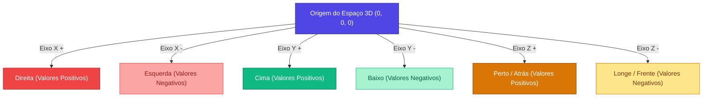

## **Fundamentos do A-Frame (Criando Mundos Virtuais 3D)**

**O seu objetivo aqui:** Compreender a mecânica do framework A-Frame, aprender a criar uma cena tridimensional puramente virtual e manipular formas geométricas básicas (primitivos) controlando suas coordenadas cartesianas, dimensões e cores.

---

### **Conceitos Fundamentais**

#### **1. O que é o A-Frame?**

O **[A-Frame](https://aframe.io/)** é uma biblioteca de código aberto desenvolvida pela equipe da Mozilla para criar mundos tridimensionais (3D) e de Realidade Virtual (VR) rodando diretamente no navegador de internet.

A grande facilidade do A-Frame é que ele usa a sintaxe amigável do HTML. Em vez de escrever códigos de matemática complexa para gerar luzes, texturas e polígonos 3D (usando linguagens como WebGL), você apenas escreve tags simples, como `<a-box>` para desenhar um cubo ou `<a-sphere>` para desenhar uma esfera.

#### **2. Primitivos do A-Frame (Formas Geométricas)**

O A-Frame disponibiliza elementos 3D básicos prontos chamados de **primitivos**. Alguns dos mais utilizados são:

- `<a-box>`: Renderiza um cubo ou paralelepípedo.
- `<a-sphere>`: Cria uma esfera (uma bola).
- `<a-cylinder>`: Desenha um cilindro (pode ser usado para criar colunas ou tubos).
- `<a-plane>`: Cria uma superfície plana 2D flutuando no espaço 3D (ótimo para representar o chão, paredes ou telas de projeção).
- `<a-sky>`: Envolve toda a cena em uma esfera gigante interna, permitindo definir uma cor de fundo ou projetar imagens de 360 graus.

#### **3. O Espaço 3D e Coordenadas (X, Y, Z)**

Para posicionar elementos no espaço tridimensional virtual, usamos três valores numéricos separados por espaços no atributo `position="X Y Z"`:

- **Eixo X (Horizontal/Largura):** Valores positivos movem o objeto para a **direita** e negativos para a **esquerda**. O valor `0` é o centro.
- **Eixo Y (Vertical/Altura):** Valores positivos movem o objeto para **cima** e negativos para **baixo**.
- **Eixo Z (Profundidade):** Valores negativos afastam o objeto para o **fundo** da cena (para longe de onde a câmera inicia). Valores positivos trazem o objeto para mais **perto** de nós.



```markdown
Exemplo: position="-1 0.5 -3"

- Moverá o elemento 1 metro para a esquerda (X: -1).
- Subirá o elemento 0,5 metros de altura (Y: 0.5).
- Afastará o elemento 3 metros para o fundo da tela (Z: -3).
```

#### **4. Rotação e Escala** e

- **Rotation (`rotation="X Y Z"`):** Define os graus de rotação do objeto ao redor de cada eixo físico (de `0` a `360` graus).
- **Scale (`scale="X Y Z"`):** Multiplica o tamanho do objeto nos eixos X, Y e Z. O valor padrão de escala de qualquer objeto é `1 1 1`. Se você colocar `2 2 2`, o objeto dobrará de tamanho em todas as direções.

---

### **Mão na Massa: Passo a Passo**

#### **Passo 1: Criando a Estrutura HTML do Mundo Virtual**

1. No VS Code, na pasta do seu projeto, crie um novo arquivo chamado `cena-virtual.html`.
2. Insira o esqueleto padrão do HTML e importe **apenas a biblioteca do A-Frame** no `<head>` (não precisaremos do AR.js nem da webcam por enquanto):

```html
<!DOCTYPE html>
<html lang="pt-BR">
  <head>
    <meta charset="UTF-8" />
    <meta name="viewport" content="width=device-width, initial-scale=1.0" />
    <title>Minha Primeira Cena 3D Virtual</title>
    <!-- Importando apenas o motor 3D A-Frame -->
    <script src="https://aframe.io/releases/1.3.0/aframe.min.js"></script>
  </head>
  <body style="margin: 0; overflow: hidden;"></body>
</html>
```

#### **Passo 2: Declarando a Cena e o Céu**

1. Dentro da tag `<body>`, crie o container da cena (`<a-scene>`).
2. Adicione a tag do céu (`<a-sky>`) com uma cor suave para termos um plano de fundo:

```html
<a-scene>
  <!-- Fundo de céu cinza claro virtual -->
  <a-sky color="#ECECEC"></a-sky>
</a-scene>
```

#### **Passo 3: Adicionando Cubos e Esferas**

Vamos começar a posicionar nossos primitivos 3D. Lembre-se de colocar coordenadas no eixo Z com valores negativos (como `-3` ou `-4`) para que eles fiquem posicionados na frente da câmera inicial.

1. Insira os seguintes elementos dentro de `<a-scene>`:

```html
<!-- Cubo vermelho à esquerda -->
<a-box position="-1 0.5 -3" rotation="0 45 0" color="#4CC3D9"></a-box>

<!-- Esfera amarela ao centro -->
<a-sphere position="0 1.25 -5" radius="1.25" color="#EF2D5E"></a-sphere>

<!-- Cilindro azul à direita -->
<a-cylinder position="1 0.75 -3" radius="0.5" height="1.5" color="#FFC65D"></a-cylinder>
```

- `radius`: Define o raio da esfera ou do cilindro.
- `height`: Controla a altura do cilindro.
- `rotation="0 45 0"`: Rotaciona o cubo em 45 graus ao redor do próprio eixo vertical para podermos ver suas quinas tridimensionais.

#### **Passo 4: Criando o Chão (Plano)**

Para os objetos não parecerem flutuar no vazio absoluto, vamos criar uma superfície de piso.

1. Adicione a tag `<a-plane>` deitada na base da cena:

```html
<!-- Chão verde deitado na base -->
<a-plane position="0 0 -4" rotation="-90 0 0" width="4" height="4" color="#7BC8A4"></a-plane>
```

> [!NOTE]
> Por padrão, a tag `<a-plane>` é criada em pé como uma folha de papel na vertical. Adicionamos `rotation="-90 0 0"` para deitá-la 90 graus na horizontal para servir como um piso real para os objetos.

#### **Passo 5: Visualizando o Mundo 3D**

1. Salve o arquivo.
2. Abra o arquivo `cena-virtual.html` com o **Live Server** (clique no botão **Go Live** no canto inferior direito do VS Code ou clique com o botão direito sobre o código e selecione **Open with Live Server**).
3. Você verá seu cenário virtual completo!
4. **Interação:** Clique com o mouse dentro da tela do navegador e arraste para olhar ao redor. Use as teclas `W`, `A`, `S` e `D` do teclado para caminhar pela cena como se estivesse jogando um jogo em primeira pessoa!

---

### **Desafio Prático**

1. Mude o valor de `position` da esfera amarela (`<a-sphere>`) para que ela fique posicionada exatamente no topo do cubo azul (`<a-box>`).
2. **Dica:** O topo do cubo está na posição `Y: 1.0` (já que a caixa tem 1 metro de altura padrão e seu centro está posicionado no `Y: 0.5`). Ajuste também os eixos X e Z para alinhar perfeitamente!
