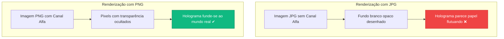
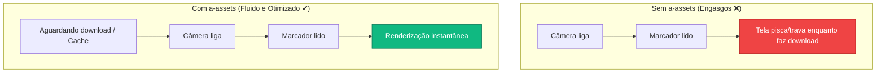

## **O Canal Alfa e as Boas Práticas (Assets)**

**O seu objetivo aqui:** Compreender a importância da transparência de pixels (Canal Alfa) para a criação de elementos integrados de forma natural à Realidade Aumentada, aprender a utilizar a tag de pré-carregamento `<a-assets>` para otimizar o desempenho do aplicativo e manter seu versionamento de código atualizado no Git.

---

### **Conceitos Fundamentais**

#### **1. O que é o Canal Alfa? (PNG vs. JPG)**

Imagens digitais comuns contêm três canais de cores primárias: Vermelho, Verde e Azul (RGB). Juntos, eles geram todas as cores que vemos na tela.

No entanto, formatos de imagem como o **PNG** contêm um quarto canal de dados chamado **Canal Alfa** (RGBA). Esse canal define a opacidade de cada pixel da imagem. Pixels com valor alfa zero são considerados 100% transparentes.

- **Imagens JPG:** Não suportam canal alfa. Se você tentar criar um recorte redondo, o JPG preencherá o resto da caixa retangular com uma cor sólida (geralmente branco ou preto). Na Realidade Aumentada, isso fica muito feio, parecendo uma folha de papel impressa flutuando no ar.
- **Imagens PNG:** Suportam canal alfa. Isso permite que o A-Frame recorte as bordas perfeitamente e exiba apenas o personagem ou logotipo flutuando fisicamente sobre a sua mesa real capturada pela câmera.



#### **2. O Sistema de Pré-Carregamento (`<a-assets>`)**

Imagens grandes ou modelos 3D podem demorar alguns segundos para baixar da internet. Se você carregar esses arquivos diretamente nas tags tridimensionais (como `<a-image src="foto-pesada.png">`), o usuário experimentará travamentos ou verá os objetos surgirem na tela com atraso (piscando do nada quando o download terminar).

Para resolver isso, usamos a tag **`<a-assets>`** (ativos/recursos) logo no topo do `<a-scene>`. Ela serve como a "sala de pré-carregamento" ou "bastidores" do seu código.

O A-Frame pausa a exibição da tela 3D até que todas as mídias listadas dentro de `<a-assets>` tenham sido totalmente baixadas pelo navegador. Desta forma, quando a câmera ligar, todos os recursos visuais estarão prontos no cache local do computador ou celular do usuário.



#### **3. O que significa `crossorigin="anonymous"`?**

Ao carregar imagens ou ativos de outros servidores na internet, os navegadores ativam bloqueios de segurança contra carregamento de mídias não autorizadas (conhecido como erros de **CORS**). Adicionar o atributo `crossorigin="anonymous"` avisa ao navegador que aquela mídia pode ser baixada publicamente sem violar credenciais de segurança do site.

---

### **Mão na Massa: Passo a Passo**

#### **Passo 1: Salvando a Imagem com Fundo Transparente**

1. Escolha ou crie uma imagem que tenha fundo transparente (PNG real).
2. Salve-a na pasta `assets` do seu projeto com o nome `personagem.png`.

#### **Passo 2: Declarando a Sala de Assets no Código**

1. No VS Code, abra o arquivo `index.html`.
2. Logo na primeira linha abaixo da tag `<a-scene>`, crie o bloco `<a-assets>`:

```html
<a-scene embedded arjs="sourceType: webcam; debugUIEnabled: false;">
  <!-- Sala de pré-carregamento dos arquivos -->
  <a-assets>
    
  </a-assets>

  <a-marker type="pattern" url="assets/meu-marcador.patt"> </a-marker>

  <a-entity camera></a-entity>
</a-scene>
```

- `id="personagem-png"`: Atribui um nome identificador único a essa mídia para podermos chamá-la em outros blocos do código de forma organizada.

#### **Passo 3: Chamando o Ativo pelo ID**

1. Dentro do bloco do seu `<a-marker>`, adicione a tag `<a-image>` e configure o atributo `src` usando o caractere `#` seguido pelo ID que você definiu:

```html
<a-marker type="pattern" url="assets/meu-marcador.patt">
  <!-- Chama o ativo pré-carregado no assets usando o seletor # -->
  <a-image
    src="#personagem-png"
    position="0 0.01 0"
    rotation="-90 0 0"
    width="1"
    height="1"
  ></a-image>
</a-marker>
```

#### **Passo 4: Versionando no Git**

Como adicionamos novos arquivos e organizamos o código de forma profissional, tire um tempo para salvar seu progresso:

1. Abra o terminal integrado no VS Code (ou use o GitHub Desktop).
2. Registre as modificações:

```bash
git add .
git commit -m "Adiciona assets em PNG e configura pre-carregamento"
```

---

### **Desafio Prático**

1. Tente colocar uma imagem JPG (com fundo branco comum) e a sua imagem PNG transparente lado a lado na mesma cena virtual para comparar o comportamento visual.
2. **Dica:** Coloque a imagem JPG na posição `position="-0.6 0.01 0"` e a PNG na posição `position="0.6 0.01 0"`.
3. Abra a prévia e perceba como o PNG parece fundido ao seu ambiente real, enquanto o JPG exibe uma moldura quadrada artificial na tela.
