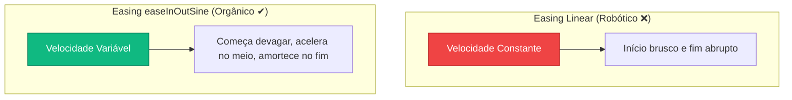
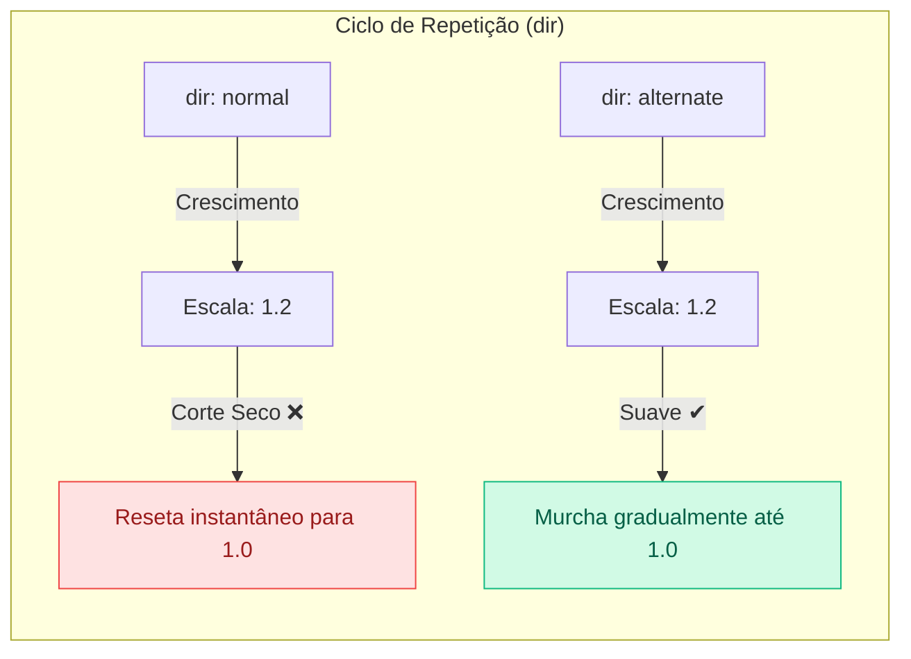

## **Animação Nativa (Pulsação)**

**O seu objetivo aqui:** Aprender a dar dinamismo e movimento aos seus elementos gráficos virtuais, dominar o uso do componente nativo de animação do A-Frame e aplicar curvas de aceleração orgânicas para criar efeitos visuais premium de pulsação sem precisar de scripts em JavaScript.

---

### **Conceitos Fundamentais**

#### **1. O Componente `animation`**

Cenas estáticas podem parecer sem vida. Na Realidade Aumentada, pequenas movimentações sutis (como um leve flutuar ou pulsar) ajudam a prender a atenção do usuário e dão a sensação de que o holograma é interativo e dinâmico.

O A-Frame possui um sistema de **animações nativas** robusto configurado diretamente através de atributos HTML. O motor gráfico encarrega-se de interpolar os valores físicos (posição, escala ou rotação) ao longo do tempo de forma suave.

#### **2. Anatomia dos Atributos de Animação**

Para configurar uma animação, passamos uma lista de parâmetros dentro do atributo `animation=""` separados por ponto e vírgula:

- **`property`:** Define qual propriedade do objeto será alterada. Os valores comuns são `position`, `rotation`, `scale` ou `material.opacity`.
- **`to`:** O valor final que o objeto deve atingir. Se a escala inicial do objeto é `1 1 1` e você define `to: 1.2 1.2 1.2`, o objeto crescerá 20% no final da animação.
- **`dur` (Duração):** O tempo de duração de um ciclo completo da animação, medido em milissegundos. Por exemplo, `1000` equivale a 1 segundo.
- **`dir` (Direção):** Controla o fluxo da repetição. Se definirmos como `alternate`, o objeto fará o caminho de volta suavemente (como um balão enchendo e esvaziando). Se usarmos `normal`, ele voltará bruscamente ao estado inicial a cada ciclo concluído.
- **`loop`:** Define se o movimento é contínuo. Usamos `true` para rodar infinitamente.
- **`easing`:** Controla a aceleração física do movimento. Movimentos com curvas lineares parecem robóticos e artificiais. Curvas como **`easeInOutSine`** ou `easeInOutQuad` fazem com que o objeto comece a se mover devagar, acelere no meio e desacelere no final, simulando a física real da gravidade ou da respiração.





---

### **Mão na Massa: Passo a Passo**

#### **Passo 1: Adicionando a Pulsação no Código**

Vamos configurar nossa ilustração para pulsar suavemente, simulando o efeito de respiração de um personagem de jogo.

1. No VS Code, abra o arquivo `index.html`.
2. Localize a tag `<a-image>` e adicione o atributo `animation`:

```html
<a-marker type="pattern" url="assets/meu-marcador.patt">
  <!-- Adiciona a pulsação de escala nativa ao personagem -->
  <a-image
    src="#personagem-png"
    position="0 0.5 0"
    width="1"
    height="1"
    rotation="0 0 0"
    animation="property: scale; to: 1.2 1.2 1.2; dir: alternate; loop: true; dur: 800; easing: easeInOutSine"
  >
  </a-image>
</a-marker>
```

#### **Passo 2: Analisando as Configurações da Animação**

No código acima:

- A escala crescerá até `1.2 1.2 1.2` (`to`).
- O ciclo de crescimento durará 800 milissegundos (`dur`).
- A direção alternada (`dir: alternate`) fará o personagem encolher de volta para a escala padrão de `1 1 1` também em 800ms.
- Isso se repetirá infinitamente (`loop: true`) de forma orgânica (`easing: easeInOutSine`).

#### **Passo 3: Testando a Experiência**

1. Salve o arquivo.
2. Abra a página com o **Live Server** (clique no botão **Go Live** no canto inferior direito) e aponte a webcam para o marcador personalizado.
3. Observe como o personagem cresce e diminui suavemente acima da folha de papel física, trazendo dinamismo instantâneo para a Realidade Aumentada!

---

### **Desafio Prático**

1. Altere o parâmetro da animação para fazer o personagem girar continuamente em vez de pulsar.
2. **Dica:** Mude o atributo `property` para `rotation`. Defina o `to` para `"0 360 0"` (uma volta de 360 graus completa sobre o eixo vertical Y).
3. Mude a direção para `dir: normal` (para que ele continue girando sempre no mesmo sentido) e ajuste o `easing` para `linear` (para manter uma velocidade constante sem desacelerações).
4. Defina uma duração de `5000` (5 segundos) para o giro não ficar rápido demais. Salve e teste o resultado!
