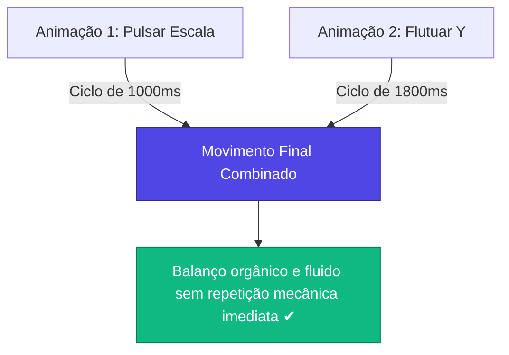

## **Empilhando Animações (Flutuando)**

**O seu objetivo aqui:** Compreender as limitações de sintaxe de atributos duplicados no HTML padrão, aprender a contornar essa regra utilizando o sistema de namespaces (duplo underscore `__`) do A-Frame e empilhar múltiplos efeitos físicos independentes (como pulsar e flutuar verticalmente) em uma única imagem holográfica.

---

### **Conceitos Fundamentais**

#### **1. A Limitação de Atributos no HTML**

No desenvolvimento web tradicional, você não pode duplicar um atributo dentro da mesma tag HTML. Por exemplo, escrever o código abaixo é inválido:

```html
<!-- CÓDIGO INCORRETO (O navegador ignorará a segunda animação) -->
<a-image animation="property: scale; ..." animation="property: position; ..."></a-image>
```

Se fôssemos limitados a essa regra, só seria possível aplicar uma única animação por vez em cada elemento tridimensional.

#### **2. O Recurso de Namespaces do A-Frame (`__`)**

Para resolver essa limitação, os criadores do A-Frame desenvolveram uma sintaxe inteligente baseada em **duplos underscores (`__`)**.

Você pode criar quantas animações desejar em um mesmo elemento, bastando adicionar o caractere `__` seguido de um nome personalizado que você inventar. O motor gráfico do A-Frame identificará todas elas como componentes individuais rodando em paralelo:

```html
<!-- CÓDIGO CORRETO -->
<a-image animation__pulsar="..." animation__flutuar="..." animation__girar="..."></a-image>
```

```
Estrutura do Namespace no compilador do A-Frame:
Tag HTML ──► Lendo animation__pulsar ──► Instancia Componente Escala (Suave)
 ──► Lendo animation__flutuar ──► Instancia Componente Posição (Suave)
```

#### **3. Criando o Efeito de Flutuabilidade Natural**

Para criar um efeito de holograma flutuante realista (semelhante a um fantasma ou objeto magnético), combinamos dois movimentos com velocidades e durações diferentes:

1. **Pulsação de Escala (`scale`):** O objeto expande e contrai levemente no tamanho a cada 1 segundo (duração de `1000`ms).
2. **Flutuação Vertical (`position` no eixo Y):** O objeto sobe e desce lentamente no ar a cada 1,8 segundos (duração de `1800`ms).

Como as durações são diferentes, os movimentos não se completam no mesmo instante, o que quebra a repetição robótica e gera um balanço muito mais suave e natural aos olhos do usuário.



---

### **Mão na Massa: Passo a Passo**

#### **Passo 1: Empilhando as Animações no Código**

1. No VS Code, abra o arquivo `index.html`.
2. Localize a tag `<a-image>` dentro de seu marcador.
3. Substitua o atributo `animation` simples por duas animações separadas usando namespaces:

```html
<a-marker type="pattern" url="assets/meu-marcador.patt">
  <!-- Aplica dois movimentos paralelos: pulsar no tamanho e flutuar na altura Y -->
  <a-image
    src="#personagem-png"
    position="0 0.5 0"
    width="1"
    height="1"
    rotation="0 0 0"
    animation__pulsar="property: scale; to: 1.1 1.1 1.1; dir: alternate; loop: true; dur: 1000; easing: easeInOutSine"
    animation__flutuar="property: position; to: 0 0.7 0; dir: alternate; loop: true; dur: 1800; easing: easeInOutQuad"
  >
  </a-image>
</a-marker>
```

#### **Passo 2: Entendendo a Variação de Posição**

- Em `animation__flutuar`, definimos `property: position`.
- O valor de destino `to: 0 0.7 0` diz ao motor gráfico para deslocar o objeto verticalmente até a altura `Y: 0.7`.
- Como a posição inicial definida no atributo principal era `position="0 0.5 0"`, o personagem ficará subindo e descendo continuamente na faixa entre **0,5 e 0,7 metros** acima da mesa real.

#### **Passo 3: Testando a Sincronização**

1. Salve o arquivo e abra-o com o **Live Server** (clique no botão **Go Live** no canto inferior direito do VS Code).
2. Aponte a webcam para o marcador físico e observe.
3. Veja como o objeto flutua verticalmente enquanto pulsa no tamanho de forma extremamente suave e premium!

---

### **Desafio Prático**

1. Adicione uma terceira animação simultânea chamada `animation__rotacionar` na sua tag `<a-image>`.
2. Configure-a para girar o personagem suavemente de um lado para o outro de forma alternada (efeito de balanço).
3. **Dica:** Use `property: rotation`, defina o destino `to: 0 20 0` (20 graus no eixo Y) e configure uma duração mais lenta (ex: `dur: 3000`), com `dir: alternate` e `loop: true`.
4. Salve e analise como a combinação de flutuação, pulsação e rotação suave cria um holograma muito mais vivo no mundo real.
