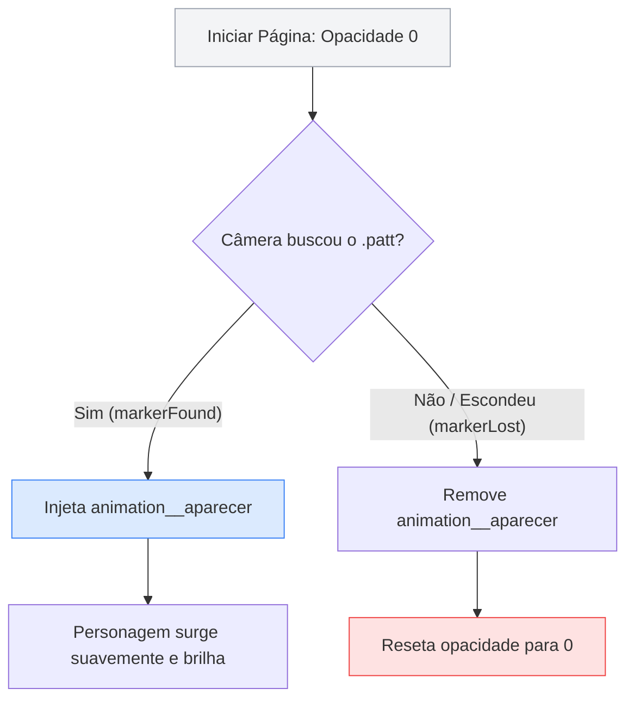

## **O Cerebelo da Aplicação (Eventos JavaScript)**

**O seu objetivo aqui:** Integrar interatividade lógica à sua aplicação usando scripts em JavaScript, escutar os eventos físicos de detecção de câmera do AR.js (`markerFound` e `markerLost`) e criar um efeito de surgimento (fade-in) e desaparecimento suave dos seus hologramas para elevar a qualidade visual da experiência.

---

### **Conceitos Fundamentais**

#### **1. O Problema do Surgimento Abrupto**

Por padrão, quando colocamos um objeto 3D dentro do bloco de um marcador, ele aparece e desaparece na tela de forma instantânea (como um piscar de luzes) quando a câmera detecta ou perde o papel físico de vista. Isso dá um aspecto amador e artificial à aplicação.

Para criarmos experiências premium, queremos que o holograma surja de forma suave, realizando um esmaecimento gradual (efeito de _fade-in_) e suma da mesma forma (_fade-out_). Para controlar esse comportamento dinâmico, precisamos de uma linguagem lógica: o **JavaScript**.

#### **2. Os Eventos de Câmera do AR.js**

O AR.js adiciona "sensores" especiais às tags de marcadores HTML. Esses sensores disparam eventos lógicos que o JavaScript consegue ler em tempo real:

1. **`markerFound` (Marcador Encontrado):** É executado no exato instante em que a câmera reconhece o padrão do seu arquivo `.patt`.
2. **`markerLost` (Marcador Perdido):** É executado no momento em que o marcador sai do campo de visão da câmera ou quando alguém o cobre com a mão.

#### **3. Manipulação de Elementos via JavaScript (DOM)**

Para fazer o holograma acender, programamos o JavaScript para fazer o seguinte fluxo de transição:



1. Iniciar o personagem com opacidade invisível (`opacity="0"`).
2. Quando o sensor acusar `markerFound`, o JavaScript injeta dinamicamente um atributo de animação de opacidade no objeto, fazendo-o ir de `0` para `1`.
3. Quando o sensor acusar `markerLost`, o JavaScript remove essa animação e retorna a opacidade para `0`, preparando o objeto para o próximo ciclo de detecção.

---

### **Mão na Massa: Passo a Passo**

#### **Passo 1: Identificando os Elementos com IDs e Ocultando a Arte**

Para que o JavaScript saiba exatamente quem controlar na tela, precisamos dar nomes (IDs) a eles e inicializar o personagem de forma invisível.

1. No VS Code, abra o arquivo `index.html`.
2. Ajuste a tag do seu marcador inserindo `id="meu-marcador"`.
3. Ajuste a tag `<a-image>` inserindo `id="arte-principal"` e o atributo `opacity="0"`:

```html
<!-- Identifica o marcador com um ID -->
<a-marker type="pattern" url="assets/meu-marcador.patt" id="meu-marcador">
  <!-- Personagem inicia invisível (opacity="0") e possui um ID -->
  <a-image
    id="arte-principal"
    src="#personagem-png"
    position="0 0.5 0"
    width="1"
    height="1"
    rotation="0 0 0"
    opacity="0"
    animation__pulsar="property: scale; to: 1.1 1.1 1.1; dir: alternate; loop: true; dur: 1000; easing: easeInOutSine"
    animation__flutuar="property: position; to: 0 0.7 0; dir: alternate; loop: true; dur: 1800; easing: easeInOutQuad"
  >
  </a-image>
</a-marker>
```

#### **Passo 2: Escrevendo a Lógica em JavaScript**

1. Logo abaixo do fechamento da tag da cena (`</a-scene>`), pouco antes do fechamento de `</body>`, adicione a tag `<script>` com a lógica de controle:

```html
 </a-scene>

 <!-- Início da programação lógica -->
 <script>
 // 1. Captura os elementos HTML em variáveis do JavaScript
 const marcador = document.querySelector('#meu-marcador');
 const arte = document.querySelector('#arte-principal');

 // 2. Escuta quando a câmera encontra o marcador
 marcador.addEventListener('markerFound', () => {
 // Injeta uma animação de fade-in na opacidade
 arte.setAttribute('animation__aparecer', 'property: opacity; to: 1; dur: 600; easing: linear');
 });

 // 3. Escuta quando a câmera perde o marcador de vista
 marcador.addEventListener('markerLost', () => {
 // Remove a animação de fade-in para evitar conflitos futuros
 arte.removeAttribute('animation__aparecer');
 // Retorna o objeto ao estado invisível
 arte.setAttribute('opacity', '0');
 });
 </script>
</body>
```

#### **Passo 3: Testando a Interatividade**

1. Salve o arquivo e abra-o com o **Live Server** (clique no botão **Go Live** no canto inferior direito do VS Code).
2. Aponte a webcam para o marcador.
3. Repare no efeito suave: o personagem não pisca na tela; ele surge gradualmente por meio de um brilho suave durante 0.6 segundos (`dur: 600`)!
4. Tire o papel da frente da câmera e coloque-o de volta para ver a transição se repetir.

---

### **Desafio Prático**

1. Além do efeito de transparência (opacidade), faça o personagem se erguer fisicamente da mesa ao ser encontrado pela câmera.
2. **Dica:** Modifique a escuta de `markerFound` para adicionar também uma animação de movimento vertical (fade-in + movimento de subida).
3. Você pode fazer isso injetando uma nova animação chamada `animation__subir` no evento `markerFound` que varie a propriedade `position` de `"0 0 0"` (deitado na mesa) para `"0 0.5 0"` (sua altura oficial de apoio em pé). Lembra de remover esse atributo no `markerLost` também!
