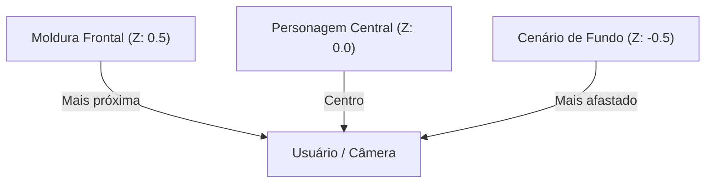

## **Desafio Final de Certificação (O Efeito Diorama)**

**O seu objetivo aqui:** Consolidar todos os conhecimentos práticos e teóricos adquiridos ao longo desta apostila construindo um projeto completo e avançado de Realidade Aumentada. Você criará um **Diorama 3D** (efeito de profundidade e paralaxe por camadas) usando imagens transparentes personalizadas, animações e controle lógico por JavaScript, versionando o projeto final no Git e publicando-o no GitHub Pages.

---

### **O Conceito do Desafio: O Efeito Diorama**

Um **Diorama** (ou teatro de sombras) é um modelo tridimensional que representa uma cena real ou fictícia por meio de camadas físicas sobrepostas posicionadas em profundidades diferentes.

No desenvolvimento 3D e na Realidade Aumentada, podemos simular esse efeito de profundidade usando três imagens 2D transparentes (PNG) alinhadas em diferentes coordenadas do **Eixo Z (Profundidade)**:

1. **Camada de Fundo (Background):** Fica posicionada mais ao fundo (coordenada Z negativa, ex: `Z: -0.5`).
2. **Camada do Personagem (Midground):** Fica posicionada ao centro (coordenada `Z: 0`).
3. **Camada de Moldura/Obstáculos (Foreground):** Fica posicionada mais perto do espectador (coordenada Z positiva, ex: `Z: 0.5`).

Quando o usuário gira o marcador físico na frente da câmera, a perspectiva matemática faz com que a camada da frente se desloque mais rápido do que a camada do fundo. Isso gera um **efeito de paralaxe tridimensional realista**, dando a impressão de que estamos espiando dentro de uma caixa tridimensional física!



---

### **Roteiro de Desenvolvimento: Passo a Passo**

#### **Passo 1: Preparação das Mídias**

1. Escolha ou desenhe três imagens PNG que tenham **fundo transparente**:

- `cenario-fundo.png` (ex: um portal de pedras, o interior de uma caverna ou estrelas no espaço).
- `personagem.png` (ex: seu avatar, um guerreiro, um robô ou animal).
- `moldura-frente.png` (ex: arbustos, rochas ou correntes que ficarão em primeiro plano moldurando a cena).

2. Salve as três imagens na pasta `assets` do seu projeto.
3. Acesse a ferramenta online [AR.js Marker Training](https://arnext.org/marker-training/) e gere um novo marcador customizado com a sua própria marca ou logotipo. Baixe o arquivo `.patt` e salve na pasta `assets` como `marcador-diorama.patt`.

#### **Passo 2: Configurando o HTML e Assets**

1. No seu arquivo `index.html`, declare as três imagens transparentes dentro do bloco de pré-carregamento `<a-assets>` definindo IDs únicos e o atributo `crossorigin="anonymous"`.
2. Configure a tag `<a-marker>` para carregar o seu arquivo `marcador-diorama.patt`:

```html
<a-marker type="pattern" url="assets/marcador-diorama.patt" id="meu-marcador"> </a-marker>
```

#### **Passo 3: Construindo as Camadas 3D (O Diorama)**

1. Dentro do bloco do seu marcador, insira as três tags `<a-image>` apontando para os IDs dos seus assets.
2. Certifique-se de que a rotação de todas as camadas esteja como `"0 0 0"` para mantê-las em pé.
3. Configure a profundidade de cada camada usando o eixo Z no atributo `position`:

- Fundo: `position="0 0.5 -0.5"`
- Meio (Personagem): `position="0 0.5 0"`
- Frente: `position="0 0.5 0.5"`

> [!IMPORTANT]
> Lembre-se da fórmula de correção de altura vista no Capítulo 9! Se a altura (`height`) das suas imagens for `1`, o posicionamento no eixo Y deve ser configurado como `0.5` em todas as camadas para que a base da cena fique colada no papel sem afundar na mesa.

#### **Passo 4: Adicionando Movimento e Lógica Interativa**

1. Insira uma animação nativa (Capítulo 10 e 11) de pulsação ou flutuação suave apenas no personagem central para dar mais dinamismo à cena.
2. Adicione o atributo `opacity="0"` em todas as três tags de imagem no HTML para que elas iniciem invisíveis.
3. No seu bloco `<script>`, crie a escuta dos eventos `markerFound` e `markerLost` (Capítulo 12) para realizar a transição de esmaecimento suave das três imagens ao mesmo tempo (fade-in ao encontrar o marcador e fade-out ao perdê-lo de vista).

#### **Passo 5: Versionamento e Publicação**

1. Abra o **GitHub Desktop** e faça o commit das modificações finais no seu repositório.
2. Dê o **Push origin** para enviar as alterações para a nuvem do GitHub.
3. Acesse as configurações (_Settings > Pages_) do seu repositório no GitHub e ative o **GitHub Pages** (Capítulo 13).
4. Copie o link seguro (HTTPS) gerado, crie um QR Code gratuito e compartilhe-o para que seus colegas possam testar o diorama em tempo real pelos seus smartphones!

---

### **Critérios de Sucesso (Checklist de Validação)**

Antes de dar o projeto por concluído, certifique-se de que:

- [ ] O aplicativo ativa a câmera do celular com sucesso através do link HTTPS público.
- [ ] Ao apontar a câmera para o seu marcador customizado, a cena em camadas é carregada.
- [ ] As três camadas de imagens PNG transparentes estão alinhadas no eixo Z, gerando o efeito de profundidade 3D (sem causar piscares ou texturas cortadas).
- [ ] Os hologramas surgem por meio de transições suaves de acendimento de opacidade controladas por JavaScript.
- [ ] O código-fonte final está devidamente versionado e salvo no seu portfólio do GitHub.
